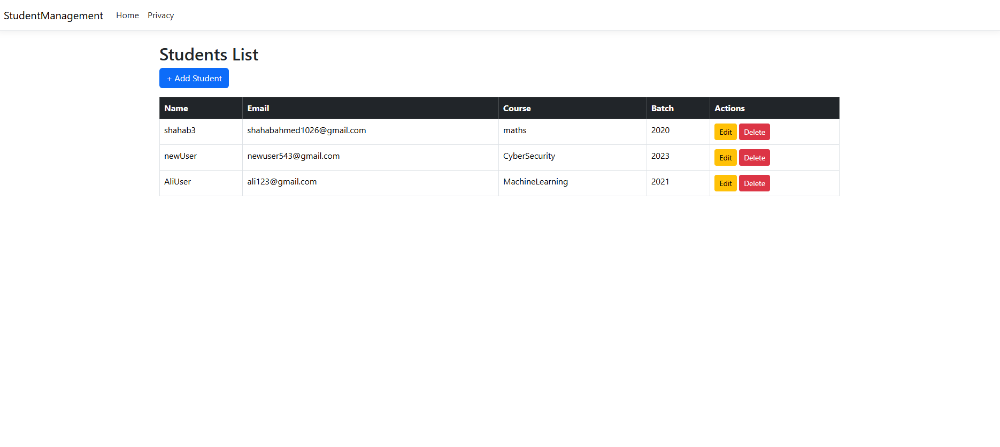
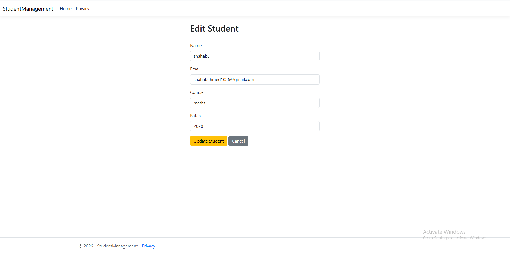
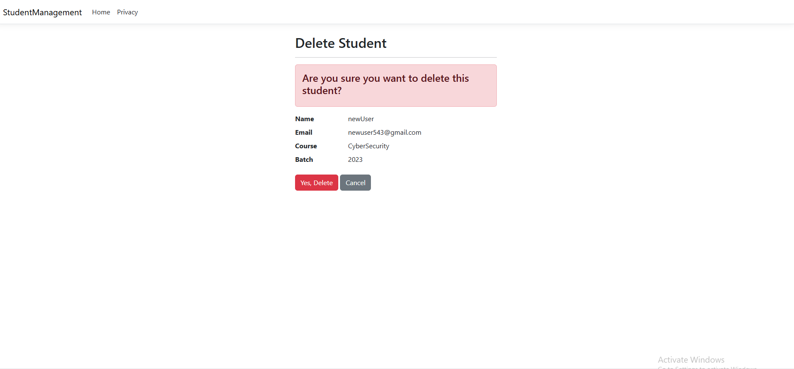

# 🎓 StudentManagement App

## 📋 Features
📚 Student List View  
➕ Add Student  
✏️ Edit Student  
❌ Delete Student  
💾 Database Integration (CRUD Operations)

## 🖼️ Screenshots

### 📄 Student List

### ➕ Add Student

### ✏️ Edit Student

### ❌ Delete Student

### 💾 Database

## 🛠️ Tech Stack
C# |.NET | SQL Server (or Local DB)
